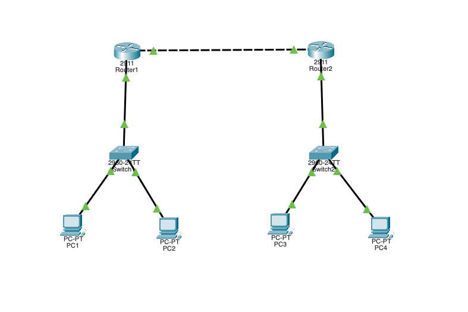

# Basic Network Lab

## Objective
Design and implement a multi-subnet LAN/WAN topology using Cisco Packet Tracer, featuring static routing, subnetting, and inter-network communication across routers and switches. 
Demonstrates core skills in routing, switching, IP addressing, and network design.

## Topology

## Steps of Completion

1. **Planned Network Topology**  
   Designed a multi-subnet LAN/WAN topology with required subnets and host assignments using Cisco Packet Tracer.

2. **Subnetting and IP Address Assignment**  
   Calculated subnet ranges and assigned IP addresses to routers, switches, and end devices.

3. **Device Configuration**  
   Configured router interfaces and switch settings to enable communication.

4. **Static Routing Setup**  
   Implemented static routing for inter-network connectivity and verified routing tables.

5. **Connectivity Testing**  
   Tested end-to-end connectivity with ping and traceroute commands.

6. **Troubleshooting and Validation**  
   Resolved configuration issues and confirmed network functionality.

## Files Included
- [Project Notes](project-notes.txt) — Detailed notes and explanations.
- [Router Configuration](configs/router.txt) - Router configuration with interface IPs and static routing commands. 
- [Testing Commands](test-commands.png) — Screenshots of verification commands.

---

Feel free to explore the files for detailed configuration and testing steps.
