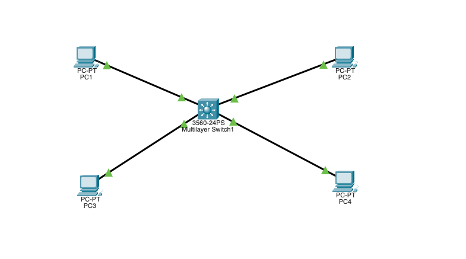

# VLAN Routing Lab

## Objective
Design and implement a multi-VLAN network using a Cisco 3560 multilayer switch to segment departmental traffic, enhance security, and enable inter-VLAN communication via Switched Virtual Interfaces (SVIs). 
This project demonstrates practical skills in VLAN configuration, Layer 3 switching, IP addressing, and network troubleshooting using Cisco IOS.

## Topology

## Key Features
- Creation of multiple VLANs for logical traffic segmentation
- Assignment of switch ports to appropriate VLANs
- Configuration of Switched Virtual Interfaces (SVIs) as default gateways
- Enabling inter-VLAN routing on a Cisco 3560 multilayer switch
- Use of Cisco IOS CLI for all configurations
- Implementation of IP addressing schemes for VLANs
- Verification of connectivity and routing using ICMP ping testing
- Troubleshooting and validation of network traffic isolation and communication

## Files
- [Project Notes](project-notes.txt)
- Configuration and testing screenshots: See included images
- Validation screenshots: See included `.png` files
